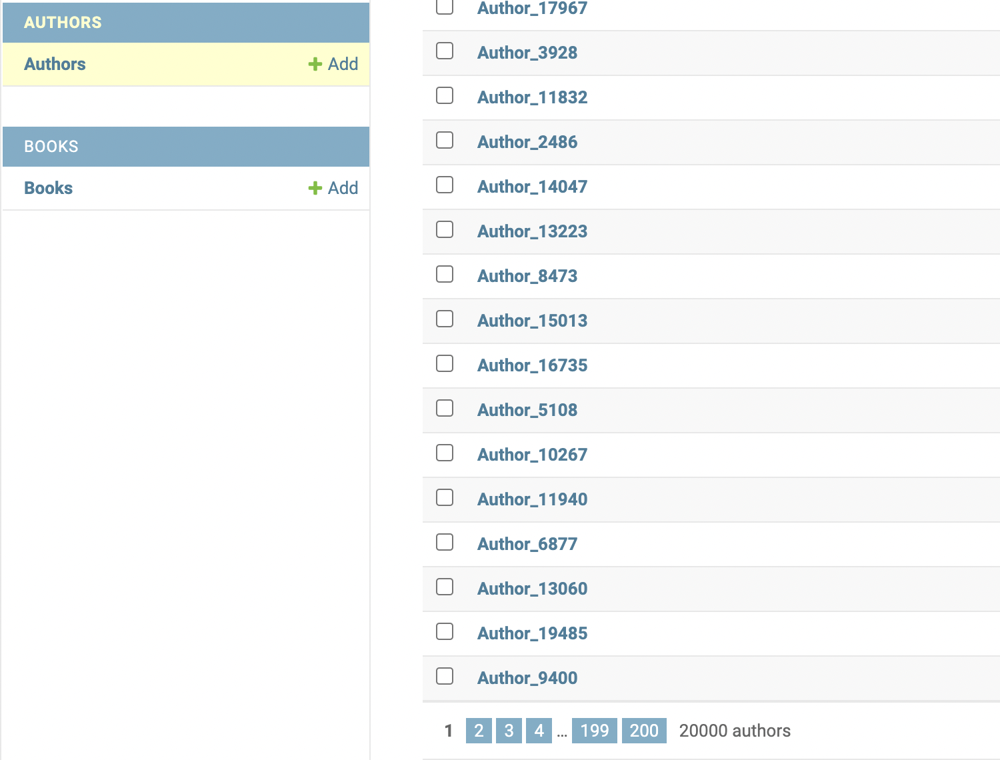

# django-performance

## Overview
Project is made for an educational purpose. The main aim is to test in practice
the server performance in different scenarios.

## Quick start
After downloading the repository simply build and run docker containers:
```shell
$ docker-compose up --build
```

Then enter the container serving django API and create a superuser.
```shell
$ docker ps
...

$ docker exec -it [container_id] bash
(django_container) $ python manage.py createsuperuser
...
```

Now populate the database with prepared seeder. 
Change N variable with any amount of Authors you'd like to create.
```shell
(django_container) $ python manage.py create_books_and_authors N
```
In my case it was 20,000 authors that I created. 
Now you can log in to django admin panel at http://127.0.0.1:8000/admin/ and
enter credentials that you used to create a superuser.
Then you should see your number of authors in Authors section like in the 
image below.



## Testing
To run tests simply run the script located in `utils_test_performance/` catalogue.
```shell
$ python api_performance.py
```

Then you should see the output in the terminal and the performance chart should
pop up in your screen.
